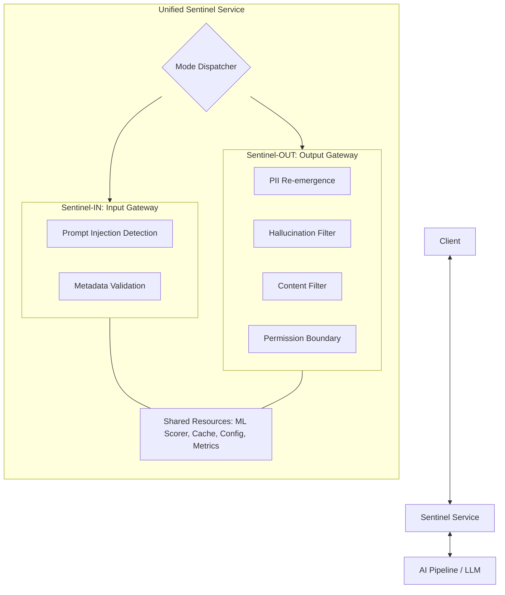

# Bastion-Sentinel Design Document

## 1. Overview
**Bastion-Sentinel** is a high-performance, bidirectional security gateway designed for Retrieval-Augmented Generation (RAG) pipelines. It serves as both the entry point (**Sentinel-IN**) and the exit point (**Sentinel-OUT**) for the Bastion framework, ensuring that LLM interactions are secure, private, and grounded.

### 1.1 Core Mission
- **Protect:** Block malicious inputs (Prompt Injection) and harmful outputs.
- **Privacy:** Prevent Personal Identifiable Information (PII) leakage through anonymization and re-emergence detection.
- **Trust:** Ensure LLM responses are grounded in retrieved context (Hallucination filtering).
- **Compliance:** Enforce metadata standards and permission boundaries.

---

## 2. Bidirectional Architecture
Sentinel operates as a unified service that handles two distinct validation phases.

---

## 3. Core Engines

### 3.1 Sentinel-IN (Input Gateway)
Responsible for inspecting queries before they reach the LLM or vector stores.

- **Prompt Injection Detector:** Uses a multi-layered approach:
    - **Regex Pattern Matching:** Fast-fail against known threat signatures.
    - **Keyword Inspection:** Case-insensitive scan for dangerous terms.
    - **ML Scorer:** ONNX-based inference to detect complex semantic attacks.
- **Metadata Validator:** Enforces structural integrity of request headers:
    - **Schema & Type Checks:** Mandatory fields (tenant_id, user_id, etc.).
    - **Business Rules:** Temporal bounds (±1 hour) and reserved identifier checks.
    - **Volumetric Constraints:** Query and metadata size limits.

### 3.2 Sentinel-OUT (Output Gateway)
Responsible for validating and sanitizing LLM responses before they reach the end-user.

- **PII Re-emergence Check:** Prevents the LLM from revealing original PII that was previously anonymized.
    - **Pattern-based Detection:** Uses high-confidence regex patterns.
    - **Pattern Engine Integration:** Leverages [pii-pattern-engine](https://github.com/zafrem/pii-pattern-engine) for comprehensive, multi-region PII signatures.
    - **Verification Logic:** Implements checksum-based verification (Luhn, Mod-97, etc.) to reduce false positives.
    - **Vault Cross-reference:** Interacts with Bastion-Vault to verify if detected PII matches previously anonymized tokens.
- **Hallucination Detection:** Compares LLM responses against the retrieved source documents from Navigator to ensure factual grounding using lexical and semantic heuristics.
- **Content Filtering:** Blocks or sanitizes harmful content, profanity, and sensitive advice (medical/legal).
- **Permission Boundary Enforcement:** Verifies the response level (e.g., specific vs. aggregated) matches the user's access privileges (e.g., K-anonymity).
- **Format Validation:** Ensures the response structure and length comply with endpoint requirements.

---

## 4. Technical Design & Infrastructure

### 4.1 Engine Orchestration
Sentinel uses a shared `ValidationEngine` core. The `engine.Engine` (Input) and `engine.OutputEngine` (Output) are decoupled but share detection primitives.

### 4.2 ML Inference (ONNX Scorer)
A high-efficiency ML pipeline using **ONNX Runtime** allows Sentinel to perform in-process scoring for prompt injection and grounding without the overhead of external API calls.

### 4.3 Caching Layer (Redis + In-Memory)
- **Deterministic Keying:** SHA-256 of `NFC(query) + sorted(metadata)`.
- **Hybrid Strategy:** Uses Redis for distributed caching with an automatic fallback to local in-memory storage if Redis is unreachable.
- **TTL:** Default 5-minute TTL for security verdicts.

### 4.4 Configuration & Hot Reload
Sentinel supports `SIGHUP` and API-triggered (`POST /v1/config/reload`) hot-reloading of rulesets (Regex, Keywords, Scoring weights) without downtime.

---

## 5. Data Flow & Request Lifecycle

### 5.1 Validation Sequence (REST/gRPC)
1. **Receive:** Request arrives at REST (:8080) or gRPC (:9090) endpoint.
2. **Dispatch:** Mode dispatcher identifies `IN` or `OUT` path.
3. **Cache Lookup:** Check for existing verdict based on input signature.
4. **Validation:** 
   - **Parallel Execution:** Detectors run in parallel (Regex + ML).
   - **Synthesis:** Scores are aggregated (max or weighted average).
5. **Action:** 
   - **PASSED:** Forward to next module or return to client.
   - **SANITIZED:** (OUT only) Modify PII/content and return.
   - **BLOCKED:** Return 403 Forbidden / Error.
6. **Telemetry:** Async logging to Elasticsearch, Metrics to Prometheus, and Alerts to Slack/PagerDuty.

---

## 6. Technical Stack
- **Language:** Go 1.21+
- **ML Runtime:** ONNX Runtime 1.16+
- **Communication:** gRPC (Protobuf), REST (JSON)
- **Cache:** Redis 7.0+
- **Observability:** Prometheus, Grafana, ELK Stack
- **Deployment:** Docker, Kubernetes (HPA enabled)

---

## 7. Security Principles
- **Defense in Depth:** Multiple layers (Regex, ML, Heuristics) ensure no single point of failure in detection.
- **Fail-Safe Defaults:** If a validation component fails or times out, Sentinel defaults to a secure "BLOCK" state.
- **Stateless Scaling:** Sentinel instances are stateless, allowing for rapid horizontal scaling during traffic spikes.
- **Context-Awareness:** Validation is performed in the context of the user, tenant, and retrieved data.
